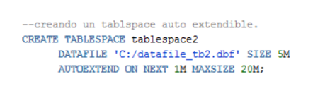
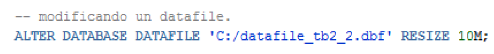

author: Author Name
summary: Laboratorio sobre Administración de alamacenamiento y usuarios 
id: laboratorio-03
tags: guide. 
categories: Roles, Usuarios.
environments: Web
status: Published
feedback link: A link where users can go to provide feedback (Maybe the git repo)
analytics account: Google Analytics ID

# Administaricón de Almacenamiento y usuarios 

## Objetivos 
Duration: 0:01:00

  * Administrar el almacenamiento de Oracle a través Tablespace y Datafiles.
* Conocer como es la sintaxis de la creación de un usuario y perfiles.
* Aprender los diferentes tipos de roles para los usuarios.

## Herramientas 
Duration: 0:01:00

Para esta práctica se hará uso de estas herramientas: 

### Oracle DB 19c 

Oracle Database es un sistema de gestión de base de datos de tipo objeto-relacional (ORDBMS, por el acrónimo en inglés de Object-Relational Data Base Management System), desarrollado por Oracle Corporation. Oracle Database 19c es la versión actual a largo plazo, que además proporciona el nivel más alto de estabilidad de la versión y el plazo más largo para asistencia y corrección de errores.

### SQL Developer 

Es una interfaz gráfica de usuario gratuita que permite a los usuarios y administradores de bases de datos realizar sus tareas con menos clicks y pulsaciones de teclas. SQL Developer es una herramienta de productividad cuyo objetivo principal es ayudar al usuario final a ahorrar tiempo y maximizar el retorno de la inversión en el paquete de tecnología de Oracle Database.

## Introducción
Duration: 0:01:00
En esta guía se dará a conocer las diferencias entre un tablespaces y datafiles, al igual que como se administran cada uno de ellos, como puede ser crearlos, cambiar sus parámetros y eliminarlos. Al igual aprenderemos como crear usuarios, a crear roles que estos mismos usuarios pueden tener y crear perfiles, y como podemos dejarles ciertos permisos dependiendo de las tareas que deben realizar.

## Administración de almacenamiento
Duration: 0:05:00
Como sabemos, Oracle guarda los datos de manera lógica en un tablespace y  físicamente en datafiles, que corresponden o están asociados a los tablespaces. Las bases de datos, tablespaces y datafiles están estrechamente relacionadas, pero es  de importancia saber que existen diferencias muy grandes:

* Una base de datos Oracle consiste en uno o más unidades de almacenamiento lógico llamados tablespaces, estos tablespaces son los que guardan todos los datos de la base de datos.
* Cada tablespaces en una base de datos Oracle consiste en uno o más archivos llamados datafiles, los cuales son la estructura física de los tablespaces.
* Los datos son guardados en datafiles que constituyen cada tablespace de la base   de datos, por ejemplo, la base de datos más simple podría tener como mínimo un tablespace y un datafiles.

## Tablespace
Duration: 0:30:00
La estructura lógica está formada por los tablespace y los objetos de un esquema de la base de  datos (tablas, vistas, índices…) 

Una base de datos está formada por una o varias unidades lógicas llamadas Tablespaces. Un tablespace es la unidad de almacenamiento lógico. Además, cada una de estos Tablespaces está formada por uno o varios ficheros físicos que son los datafiles. Un datafile solamente puede pertenecer a un tablespace. Por lo tanto, los datafiles de una base de datos son todos los datafiles que forman parte de todos los tablespaces de la base.
Cuando se crea una base de datos, hay que crear al menos un tablespace, por lo que durante el proceso de creación de la base de datos siempre se indica el tablespace principal de ésta, que se llama SYSTEM.

*Propiedades:* 
* Localización de los ficheros de datos.
* Especificación de máximas cuotas de consumo de disco.
* Backup de datos.

Cuando un objeto se crea dentro de un cierto Tablespace, este objeto adquiere todas las
propiedades antes descritas del Tablespace utilizado.

*Características:*
*  Debe estar asociado a un Datafiles.
*  Un Tablespace está asociado a uno o varios Datafiles y puede tener uno o ovarios usuarios.

### 5.1 Creación de Tablespace
Una de las tareas habituales en la administración de una base de datos Oracle es la de crear
un nuevo Tablespace para contener nuevos objetos, La sentencia CREATE TABLESPACE sirve
para crear un tablespace en una base de datos Oracle. Recordemos que los Tablespaces
permanentes contienen objetos, tablas, índices, etc. de uno o más esquemas. Los objetos en
los tablespaces permanentes se almacenan en archivos de datos, datafiles.

**Ejemplo 1.1** 

### 5.2 SQL Developer 
Podemos crear tablespaces donde el/los datafiles se vayan extendiendo de forma automática,
si lo creamos de esta manera debemos tener cuidado en no olvidar la cláusula MAXSIZE, ya
que si la omitimos el datafile se extenderá hasta llenar el filesystem donde esté creado. 

**Ejempo 2.2** 

### 5.3 SQL Developer
Para cambiar el tamaño de un tablespace tenemos dos posibles opciones:
*  Modificar el tamaño de un datafile.
*  Agregar un nuevo datafile.
* 
**Ejemplo 1.3. agregando nuevos datafiles.**

Ahora modificaremos el tablespace creado en el Ejercicio 1. Antes de modificarlo es
recomendable ver cuántos datafiles conforman el tablespace, y que tamaño tienen, para en base
a esta información, añadir uno nuevo, siguiendo el estándar de nombres, y el tamaño apropiado.

A continuación, se presenta la forma de ver la información de los datafiles del tablespace.

Si ejecutamos este SELECT con el tablespace llamado “tablespace2” veremos la siguiente información:

Lo que nos indica que este tablespace posee un solo datafile de 5 MB de tamaño. A continuación, agregamos un nuevo datafile.

Mostrando la información de tablespace2 nuevamente:

**Ejemplo 1.4 modificando un datafile.**

También podemos modificar un datafile existente.

Mostrando la información de tablespace2 nuevamente:

### 5.4. SQL Developer
Primero debemos asegurarnos de que el contenido de los archivos de datos no es necesario, o se ha movido a otro tablespace.

**Ejemplo 1.5**

Borrando el tablespace1 anteriormente creado.

*¡La sentencia anterior borra un tablespace, pero NO los datafiles!* ahora podemos ir a borrar manualmente el datafile. La siguiente instrucción borra un tablespace incluyendo sus datafiles.

